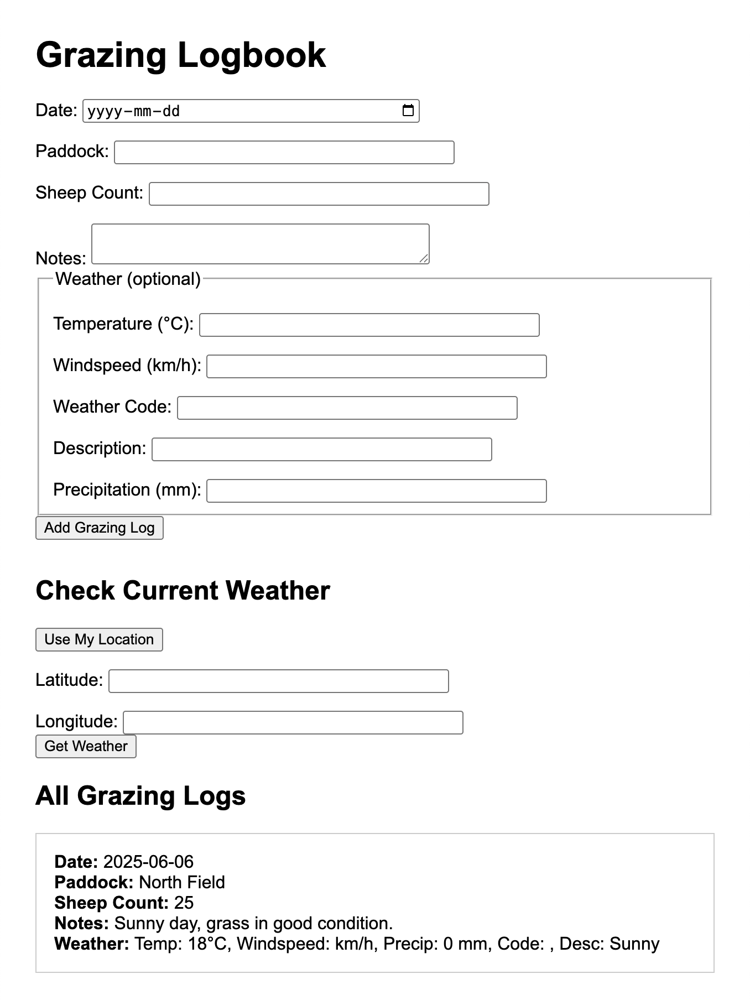

# Grazing Logbook App

A tool for sheep farmers to log daily grazing activities and check the weather forecast to plan effectively. It uses the Open-Meteo API and saves logs in MongoDB.



## Tech Stack
- **Backend:** Node.js, Express.js
- **Database:** MongoDB (local or cloud)
- **ODM:** Mongoose
- **Weather API:** Open-Meteo
- **Dev Tools:** VS Code, MongoDB Compass (optional)

## Getting Started

### Prerequisites

- **Node.js**  
  Download and install from [https://nodejs.org/](https://nodejs.org/).

- **MongoDB**  
  Download and install from [https://www.mongodb.com/try/download/community](https://www.mongodb.com/try/download/community).

  > **Tip:** On Mac, you can also use Homebrew:  
  > ```sh
  > brew tap mongodb/brew
  > brew install mongodb-community
  > ```

---

### Start MongoDB

If installed locally, start MongoDB with:
```sh
/Applications/mongodb-macos-aarch64-8.0.9/bin/mongod --dbpath ~/data/db
```
Or, if installed with Homebrew:
```sh
brew services start mongodb-community
```

---

### Start the Server

```sh
npm install
node server.js
```
---

Now visit [http://localhost:3000](http://localhost:3000) in your browser.

### API Endpoints
- `POST /grazing` — Add a grazing log
- `GET /grazing` — List all grazing logs
- `GET /grazing/:id` — Get a grazing log by ID

## Project Files

- **models/GrazingLog.js** — Mongoose model for grazing logs
- **routes/grazing.js** — Express routes for grazing logs
- **utils/openMeteoApi.js** — Utility for fetching weather data

## Mongoose Model Explanation

The app uses [Mongoose](https://mongoosejs.com/) to define and interact with grazing log data in MongoDB. Below is the schema used for storing each grazing log:

```javascript
const GrazingLogSchema = new mongoose.Schema({
    date: { type: Date, required: true },
    paddock: { type: String, required: true },
    sheep_count: { type: Number, required: true },
    notes: { type: String, default: '' },
    weather: {
        temperature: Number,
        windspeed: Number,
        weathercode: Number,
        description: String,
        precipitation: Number
    }
}, { timestamps: true });
```

- **date**: The date of the grazing activity.
- **paddock**: The name or identifier of the paddock used.
- **sheep_count**: Number of sheep grazing.
- **notes**: Optional notes about the activity.
- **weather**: Weather details (temperature, windspeed, weather code, description, precipitation) for that day.
- **timestamps**: Automatically adds `createdAt` and `updatedAt` fields.

This schema ensures all grazing logs are consistently structured and easily queried from MongoDB.

## Weather Integration

The app allows users to:
- Fetch current weather (temperature, windspeed, precipitation, and weather code/description) for any coordinates using the Open-Meteo public API from the frontend.
- Manually copy the weather data into the grazing log form when creating a new log.

**Note:** Weather data is not automatically saved to logs; users must enter it based on the fetched results.