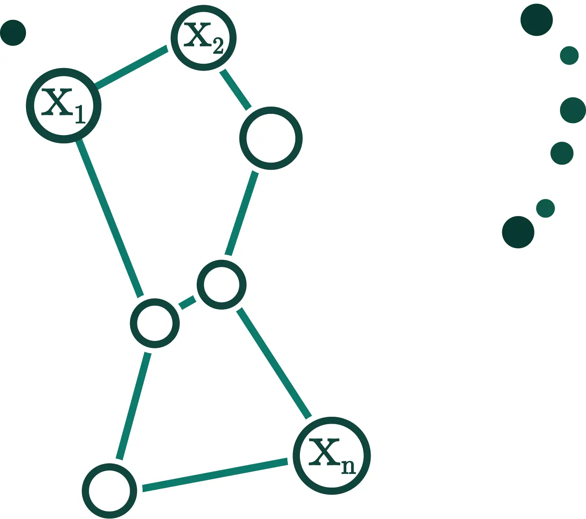

# 🎙️ Voice → 🧠 Parkinson's Detection

## 🚀 What We Did
Trained deep neural network to detect Parkinson's disease from voice alone, achieving **99.4% accuracy**!

## 🛠️ Tech Stack
####     PyTorch - Deep learning framework
####  [SpeechBrain](https://speechbrain.github.io/) - Speech processing toolkit
####  [Orion Framework](https://orion.readthedocs.io/en/stable/install/gettingstarted.html) - Hyperparameter optimization
#### 🤗 [HuggingFace](https://huggingface.co/) - Pre-trained models and [dataset](https://huggingface.co/datasets/birgermoell/Italian_Parkinsons_Voice_and_Speech)

## 💡 Why It Matters
Speech changes often appear **before** other Parkinson's symptoms. Early detection = better outcomes.

## 🔬 Models We Tested
| Model | Accuracy | Description                                                                 |
|-------|----------|-----------------------------------------------------------------------------|
| 🥇 WavLM | 99.4% | Fine tunning pretrained self supervised model wiith just 2 training epochs! |
| 🥈 Wav2Vec2 | 99.2% | Fine tunned self-supervised model                                           |
| 🥉 Xvector+FBanks | 98% | Memory efficient model trained from scratch                                 |
| ⭐ Xvector+MFCCs | 94-97% | Comparable performance (memory and accuracy) with FBanks                    |
| 🤔 ECAPA-TDNN | 85-90% | Fine tunning pretrained model with noise                                    |

## 📱 Future Scope
Your smartphone analyzing speech patterns during regular calls, providing early warning for millions. No labs. No waiting.

## 🔍 Curious
Dive into our Jupyter notebook to see how we did it!

```bash
# Clone the repository
git clone https://github.com/Arpnik/speech-pd-detection

# Navigate to the project directory
cd speech-pd-detection

# Open the notebook
jupyter notebook main.ipynb
```

## 🔮 Future Implications
This work represents a step toward accessible, early Parkinson's detection that could be deployed via smartphones or other common devices, potentially revolutionizing how we screen for this condition.
Dive into the notebook to discover the complete methodology and findings!

## 🤯 The Future Is Listening
